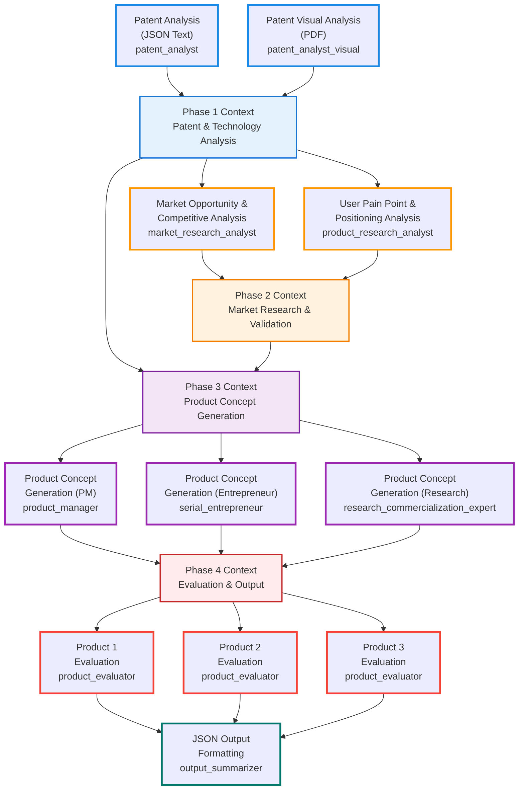

# Objective

We build a multi-agents workflow with CrewAI to read patent data and make potential product ideas.

# Project structure

```
.
├── Readme.md                                 # This file, providing an overview of the project.
├── Task_current.md                           # Description of the current task or sprint.
├── extract_json.py                           # Script to extract specific patent data from JSONL files.
├── docs/                                     # Project documentation.
├── data/                                     # Contains datasets and extracted patent information.
│   ├── computer_science/                     # Data specific to computer science patents.
│   ├── material_chemistry/                   # Data specific to material chemistry patents.
│   └── nlp/                                  # Data specific to NLP patents.
│       ├── nlp.jsonl
│       └── pdf_and_image/                    # Stores PDF and image files for NLP patents.
├── knowledge/                                # Knowledge base for agents, mirroring data/
│   ├── computer_science/                     
│   ├── material_chemistry/                   
│   └── nlp/                                  # Data specific to NLP patents.
│       └── pdf_and_image/                    # Stores PDF and image files for NLP patents.
│           └── US-2020073983-A1/             # Patent data for a given application-number (pdf, json, and images)
├── output/                                   # Stores output files generated by the crew.
├── src/                                      # Source code for the patent processing application.
│   └── patent_crew/                          # Main package for the patent crew application.
│       ├── config/                           # Configuration files for the application.
│       │   ├── agents.yaml                   # Generic config files (agents & tasks)
│       │   └── tasks.yaml
│       │   └── ...                           # Specific configs for different topic (e.g. NLP)
│       ├── crew.py                           # Defines the CrewAI agents and tasks.
│       ├── main.py                           # Main script to run the patent crew.
│       └── tools/                            # Custom tools used by the CrewAI agents.
│           └── custom_tool.py
└── tests/                                    # Contains tests for the application.
```

# Technology

Use CrewAI documentation for central concepts: Agents, Task, Crew, Knowledge, Tools

Features:
[x] multi-agent coordination
[x] web search 
[x] custom tool: json loading, PDF loading
[x] vision capabilities: sends PDF to LLM for visual interpretation
[x] validator
[x] async kick off

# Enhanced Multi-Agent Framework

The system implements a 4-phase pipeline with 11 agents working in parallel and sequential coordination:

## Phase 1: Patent & Technology Analysis (2 Agents)
- **Patent Analyst**: Extracts technical details from patent JSON text data
- **Patent Analyst Visual**: Analyzes patent PDF documents for visual elements and diagrams

## Phase 2: Market Research & Validation (2 Agents) 
- **Market Research Analyst**: Identifies market opportunities and competitive landscape (top-down approach)
- **Product Research Analyst**: Analyzes user pain points and positioning opportunities (bottom-up approach)

## Phase 3: Product Concept Generation (3 Agents)
- **Product Manager**: Generates concepts using traditional PM methodologies
- **Serial Entrepreneur**: Creates alternative concepts with startup execution mindset
- **Research Commercialization Expert**: Bridges academic innovation with market applications

## Phase 4: Evaluation & Output Formatting (4 Agents)
- **Product Evaluator 1-3**: Evaluate each concept using 6-criteria framework (technical validity, innovativeness, specificity, need validity, market size, competitive advantage)
- **Output Summarizer**: Compares evaluated products, selects winner, formats into final JSON output

## Workflow Architecture



# Outcome

**Input**: knowledge base directories:

Knowledge base structure:
- knowledge/{category}/pdf_and_image/{publication_number}/ with the following files:
  - {publication_number}.json
  - {publication_number}.pdf
  - {1.png}, {2.png}, etc.

- each entry of {category}.jsonl  is a dictionary that tracks available files for each patent:
  - publication_number: the publication number of the patent
  - json_file_path: the path to the json file
  - pdf_file_path: the path to the pdf file
  - image_file_paths: list of image file paths [path_to_{1.png}, path_to_{2.png}, etc.]

**Output**: a json file
- Product title: A concise name for your product  (up to 100 characters).
- Product description: A brief explanation of the product outlining its essential features and functions, the target users, their needs, and the benefits provided by the product (up to 300 characters).
- Implementation: An explanation describing how you will implement the patent's technology into your product (up to 300 characters).
- Differentiation: An explanation highlighting what makes your product unique and the reason why it stands out from existing solutions (up to 300 characters).

Example output:
```json
{
  "publication_number": "US-202117564168-A",
  "title": "NameGuard: AI-Powered Access Control for Enterprise Systems",
  "product_description": "NameGuard helps IT admins and compliance teams block unauthorized access by checking user names against global deny lists and using AI to catch name variations. It's ideal for finance, defense, and critical infrastructure sectors needing strong security and compliance.",
  "implementation": "Use the patented method to integrate a name screening API into login or user registration flows. Names are matched against an updated denylist, decomposed, and analyzed via a neural network to detect obfuscated identities. Access decisions are then returned to the enterprise system.",
  "differentiation": "Unlike traditional DPL checks, NameGuard detects partial or altered name matches using name decomposition and machine learning. It adapts to evolving threats, aggregates multi-source deny lists, and flags suspect names not yet on known lists, reducing false negatives and increasing compliance accuracy."
}
```

# Usage

1. Setup CrewAI project as in Quickstart guide: https://docs.crewai.com/quickstart
2. Make sure .env exist:
   - OPENAI_API_KEY
   - SERPER_API_KEY
   - AGENTOPS_API_KEY
   - GOOGLE_API_KEY # for Gemini vision tool
3. Run `setup_data.py` to prepare knowledge base
4. Change `src/patent_crew/crew.py` to load correct config in `/src/config/xyz.yaml`
5. Run crew with `uv run src/patent_crew/main.py`