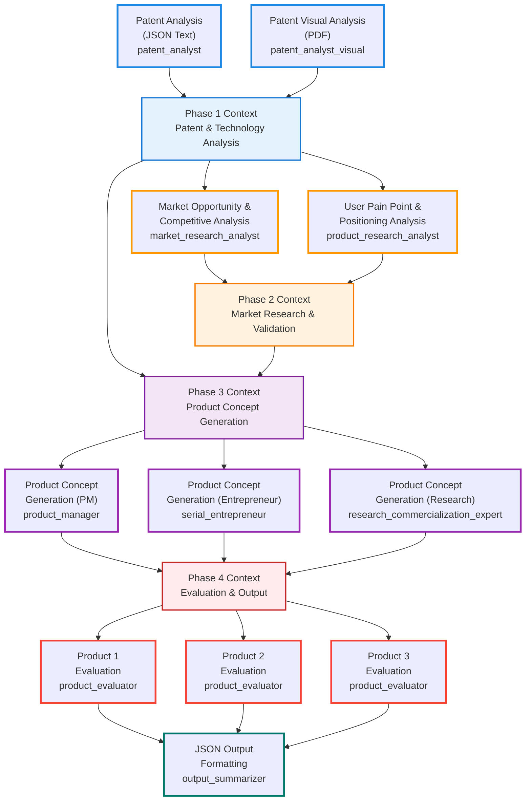

# IMPROVEMENT PLAN: Enhanced Multi-Agent Patent-to-Product Framework

# PHASE 1: PATENT & TECHNOLOGY ANALYSIS
**2 Agents in Parallel**

### Patent Analyst (Existing)
```yaml
patent_analyst:
  role: Patent Technology Analyst
  goal: Extract and analyze technical details from patent JSON text data
  backstory: Expert in patent analysis with deep technical background
  tasks:
    - patent_text_analysis: Extract key technical concepts, claims, and innovations
    - technology_assessment: Evaluate technical merit and novelty
    - technical_documentation: Document core patent technology details
```

### Patent Analyst Visual (Existing)
```yaml
patent_analyst_visual:
  role: Patent Visual Documentation Analyst  
  goal: Analyze patent PDF documents for visual elements, diagrams, and supplementary information
  backstory: Specialist in visual patent analysis and technical documentation interpretation
  tasks:
    - visual_analysis: Extract information from patent diagrams, figures, and visual elements
    - supplementary_documentation: Analyze non-text patent elements
    - visual_technical_validation: Cross-reference visual elements with technical claims
```

---

# PHASE 2: MARKET RESEARCH & VALIDATION
**2 Agents in Parallel**

### Market Research Analyst (New)
```yaml
market_research_analyst:
  role: Market Research Analyst (Top-Down)
  goal: Identify market opportunities, size potential domains, and map competitive landscape
  backstory: Expert in market sizing, trend analysis, competitive strategy, and opportunity assessment
  tasks:
    - market_opportunity_analysis: Current market trends supporting patent technology
    - domain_identification: Industries where patent could create value
    - competitive_landscape_mapping: Current players and their limitations
```

### Product Research Analyst (New)
```yaml
product_research_analyst:
  role: Product Research Analyst (Bottom-Up)
  goal: Analyze existing solutions, identify gaps, user pain points, and positioning opportunities
  backstory: Specialist in user research, competitive analysis, product-market fit, and differentiation strategy
  tasks:
    - user_pain_point_validation: Specific problems related to this domain users currently face
    - competitive_gap_analysis: Where existing solutions fall short
    - willingness_to_pay_assessment: Price sensitivity and value perception
    - differentiation_strategy: How patent creates unique positioning
```

---

# PHASE 3: PRODUCT CONCEPT GENERATION
**3 Agents in Parallel**

### Product Manager (Existing, Enhanced)
```yaml
product_manager:
  role: Senior Product Manager
  goal: Generate comprehensive product concepts using traditional PM methodologies
  backstory: Experienced product manager with expertise in product-market fit, user research, and go-to-market strategy
  tasks:
    - generate product concept following given format
    - Output: Standard JSON format - concept_title (60-100 chars), product_description (200-300 chars), 
      implementation (200-300 chars), differentiation (200-300 chars)
```

### Serial Entrepreneur (New)
```yaml
serial_entrepreneur:
  role: Serial Entrepreneur  
  goal: Generate alternative product concepts with startup execution mindset
  backstory: Multiple successful exits, expert in bootstrap-friendly product development
  tasks:
    - generate product concept following given format
    - Output: Standard JSON format - concept_title (60-100 chars), product_description (200-300 chars), 
      implementation (200-300 chars), differentiation (200-300 chars)
```

### Research Commercialization Expert (New)
```yaml
research_commercialization_expert:
  role: Research Commercialization Expert
  goal: Generate product concepts bridging academic innovation with market applications
  backstory: Expert in technology transfer, research-to-market translation, successful at commercializing breakthrough technologies
  tasks:
    - generate product concept following given format
    - Output: Standard JSON format - concept_title (60-100 chars), product_description (200-300 chars), 
      implementation (200-300 chars), differentiation (200-300 chars)
```

---

# PHASE 4: EVALUATION & OUTPUT FORMATTING
**2 Agents: 3 Parallel Evaluation Tasks + 1 Sequential Summarizer**

### Product Evaluator (New)
```yaml
product_evaluator:
  role: YC Managing Partner & Ex-Startup CEO
  goal: Evaluate product concepts using 6-criteria framework (technical validity, innovativeness, specificity, need validity, market size, competitive advantage)
  backstory: Managing Partner at world-class accelerator like Y Combinator, former startup CEO with successful exit, expert in both investment evaluation and operational execution
  
  # Handles 3 parallel evaluation tasks:
  tasks:
    - product_evaluation_pm_task: Evaluate Product Manager concept on 6 criteria (1-5 scale)
    - product_evaluation_entrepreneur_task: Evaluate Serial Entrepreneur concept on 6 criteria (1-5 scale)  
    - product_evaluation_research_task: Evaluate Research Commercialization concept on 6 criteria (1-5 scale)
    - comprehensive_assessment: Assess from both investment and execution perspectives
    - format_evaluation: Output JSON with product details and scores for each concept
```

### Output Summarizer (New)
```yaml
output_summarizer:
  role: Technical Product Documentation Specialist
  goal: Compare 3 evaluated products, select winner, transform into exact JSON format matching tasks_nlp.yaml structure
  backstory: Expert in product documentation and technical writing with experience in patent commercialization
  tasks:
    - compare_products: Take all 3 evaluation task results and compare total scores
    - select_winner: Choose product with highest total score (or make tie-breaking decision)
    - format_output: Convert winning product to exact tasks_nlp.yaml JSON structure 
    - optimize_content: Ensure character limits (60-100 title, 200-300 descriptions)
    - validate_format: Ensure perfect JSON schema match
  expected_output: >
    Valid JSON object with EXACT structure from tasks_nlp.yaml:
    {
      "publication_number": "US-XXXXXXXXX-A",
      "title": "60-100 character product title",
      "product_description": "200-300 character description with target users, needs, and benefits", 
      "implementation": "200-300 character technical implementation approach",
      "differentiation": "200-300 character unique competitive advantages"
    }
```

---

## Evaluator Framework

### Standardized 6-Criteria Evaluation
All evaluators use identical scoring framework from eval.md (1-5 scale with detailed guidelines):

1. **Technical Validity**: Assessment of whether the patented technology can be practically implemented within realistic constraints (1-3 years)
2. **Innovativeness**: Evaluation of how novel and differentiated the patented technology is compared to existing solutions
3. **Specificity**: Assessment of how clearly defined and focused the patent application is in terms of target users and use cases
4. **Need Validity**: Verification that target users have a genuine, pressing need for the solution described in the patent
5. **Market Size**: Assessment of the total addressable market and potential user base for the patented technology
6. **Competitive Advantage**: Evaluation of strategic business benefits and differentiation the patent provides vs competitors

Each criterion follows detailed scoring guidelines:
- **5 - Excellent/Breakthrough**: Highest level achievement in this dimension
- **4 - Good/Strong**: Above average performance with clear benefits
- **3 - Average/Moderate**: Adequate performance meeting basic requirements
- **2 - Poor/Weak**: Below average with significant concerns
- **1 - Unacceptable/No benefit**: Fails to meet minimum standards

### Phase 4: Evaluation & Output Formatting (1 Agent with 3 Parallel Tasks + 1 Sequential Agent)

#### Product Evaluator (Single Agent Handling 3 Parallel Tasks)
```yaml
product_evaluator:
  role: YC Managing Partner & Ex-Startup CEO
  goal: Evaluate product concepts using 6-criteria framework (technical validity, innovativeness, specificity, need validity, market size, competitive advantage)
  backstory: Managing Partner at world-class accelerator like Y Combinator, former startup CEO with successful exit, expert in both investment evaluation and operational execution
  
  # Handles 3 parallel evaluation tasks:
  
  product_evaluation_pm_task:
    - evaluate_pm_product: Score Product Manager concept on 6 criteria (1-5 scale)
    - comprehensive_assessment: Assess from both investment and execution perspectives
    - format_evaluation: Output JSON with product details and scores
    expected_output: >
      {
        "product_1": {
          "product_1_full_json": {
            "concept_source": "product_manager",
            "concept_title": "Original title from PM",
            "product_description": "Full product description",
            "implementation": "Implementation details",
            "differentiation": "Differentiation points"
          },
          "scores_1": {
            "technical_validity": 4,
            "innovativeness": 3,
            "specificity": 4,
            "need_validity": 5,
            "market_size": 4,
            "competitive_advantage": 3,
            "total_score": 23
          }
        }
      }
  
  product_evaluation_entrepreneur_task:
    - evaluate_entrepreneur_product: Score Serial Entrepreneur concept on 6 criteria (1-5 scale)
    - comprehensive_assessment: Assess from both investment and execution perspectives
    - format_evaluation: Output JSON with product details and scores
    expected_output: >
      {
        "product_2": {
          "product_2_full_json": {
            "concept_source": "serial_entrepreneur",
            "concept_title": "Original title from Entrepreneur",
            "product_description": "Full product description",
            "implementation": "Implementation details",
            "differentiation": "Differentiation points"
          },
          "scores_2": {
            "technical_validity": 5,
            "innovativeness": 4,
            "specificity": 3,
            "need_validity": 4,
            "market_size": 3,
            "competitive_advantage": 4,
            "total_score": 23
          }
        }
      }
  
  product_evaluation_research_task:
    - evaluate_research_product: Score Research Commercialization concept on 6 criteria (1-5 scale)
    - comprehensive_assessment: Assess from both investment and execution perspectives
    - format_evaluation: Output JSON with product details and scores
    expected_output: >
      {
        "product_3": {
          "product_3_full_json": {
            "concept_source": "research_commercialization_expert",
            "concept_title": "Original title from Research Expert",
            "product_description": "Full product description",
            "implementation": "Implementation details",
            "differentiation": "Differentiation points"
          },
          "scores_3": {
            "technical_validity": 3,
            "innovativeness": 5,
            "specificity": 4,
            "need_validity": 3,
            "market_size": 4,
            "competitive_advantage": 5,
            "total_score": 24
          }
        }
      }
```

#### Output Summarizer
```yaml
output_summarizer:
  role: Technical Product Documentation Specialist
  goal: Compare 3 evaluated products, select winner, transform into exact JSON format matching tasks_nlp.yaml structure
  backstory: Expert in product documentation and technical writing with experience in patent commercialization
  tasks:
    - compare_products: Take all 3 evaluation task results and compare total scores
    - select_winner: Choose product with highest total score (or make tie-breaking decision)
    - format_output: Convert winning product to exact tasks_nlp.yaml JSON structure 
    - optimize_content: Ensure character limits (60-100 title, 200-300 descriptions)
    - validate_format: Ensure perfect JSON schema match
  expected_output: >
    Valid JSON object with EXACT structure from tasks_nlp.yaml:
    {
      "publication_number": "US-XXXXXXXXX-A",
      "title": "60-100 character product title",
      "product_description": "200-300 character description with target users, needs, and benefits", 
      "implementation": "200-300 character technical implementation approach",
      "differentiation": "200-300 character unique competitive advantages"
    }
  context:
    - Takes input from product_evaluation_pm_task, product_evaluation_entrepreneur_task, and product_evaluation_research_task results
```

## Streamlined Evaluation Process

### Parallel + Sequential Execution in Phase 4
1. **Parallel Evaluation** (3 tasks using same agent):
   - **product_evaluation_pm_task**: Evaluates Product Manager concept using 6-criteria framework
   - **product_evaluation_entrepreneur_task**: Evaluates Serial Entrepreneur concept using 6-criteria framework  
   - **product_evaluation_research_task**: Evaluates Research Commercialization concept using 6-criteria framework
2. **Sequential Selection & Formatting**:
   - **output_summarizer**: Takes all 3 evaluation results, selects winner by highest total score, formats into tasks_nlp.yaml JSON structure

### Decision Criteria
- **Investment Lens**: Market opportunity, competitive advantage, scalability potential
- **Execution Lens**: Technical feasibility, go-to-market strategy, resource requirements
- **Combined Assessment**: Concepts that score well on both investment attractiveness AND execution viability

### Final Output Structure
```yaml
Final JSON Output (tasks_nlp.yaml format):
{
  "publication_number": "US-XXXXXXXXX-A",
  "title": "60-100 character product title",
  "product_description": "200-300 character description with target users, needs, and benefits", 
  "implementation": "200-300 character technical implementation approach",
  "differentiation": "200-300 character unique competitive advantages"
}
```

---

# ENHANCED SYSTEM ARCHITECTURE

## Improved Multi-Agent Framework

**Pipeline Design**: Parallel 9-agent system with phase-based specialization and direct context flow
- **Phase 1**: Patent & Technology Analysis (2 agents)  
- **Phase 2**: Market Research & Validation (2 agents)
- **Phase 3**: Product Concept Generation (3 agents)
- **Phase 4**: Evaluation & Output Formatting (2 agents)

**Workflow Pattern**: Phase-based parallel processing with direct context flow between phases


