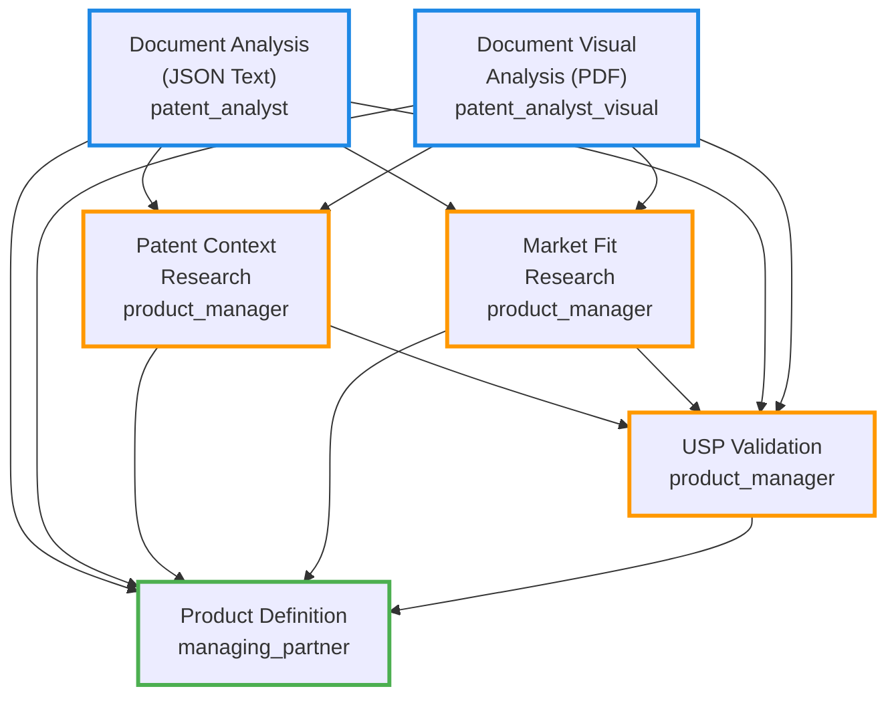
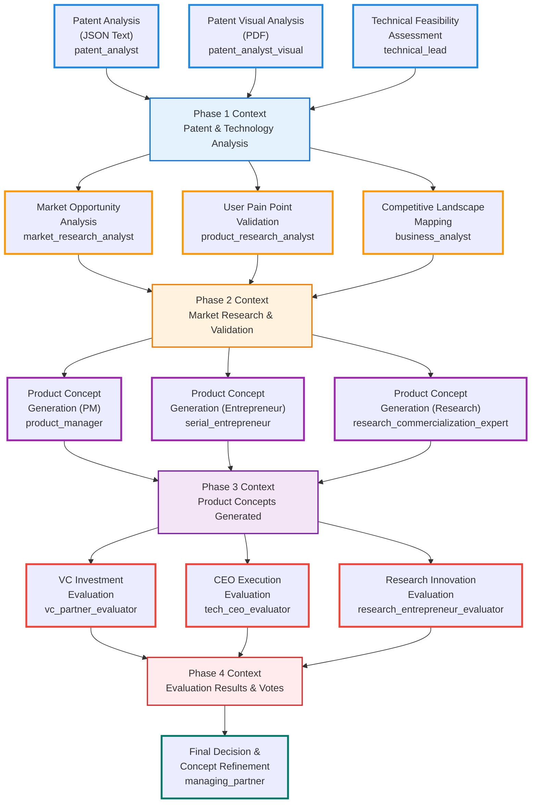

# Multi-Agent System Design Analysis Summary

## Current System Architecture

**Pipeline Design**: Sequential 4-agent system with specialized roles
- **Technical Layer**: `patent_analyst` (JSON) + `patent_analyst_visual` (PDF)  
- **Business Layer**: `product_manager` (market research) + `managing_partner` (synthesis)

**Workflow Pattern**: Linear dependency chain with context accumulation



---

# IMPROVEMENT PLAN: Enhanced Multi-Agent Patent-to-Product Framework

## System Limitations Analysis

### Current System Gaps
1. **Limited Technical Feasibility Assessment** - No dedicated technical validation
2. **Insufficient Market Research Depth** - Single agent handling all market research
3. **No Structured Evaluation Framework** - Linear flow without systematic scoring
4. **Missing Entrepreneurial Perspective** - Only VC viewpoint for final decisions
5. **Weak Validation Process** - Basic web search without deep competitive analysis

## Enhanced Multi-Agent Architecture

### Phase 1: Patent & Technology Analysis (3 Agents in Parallel)
```yaml
Technical Analysis Layer:
- patent_analyst: JSON text analysis (existing)
- patent_analyst_visual: PDF visual analysis (existing)  
- technical_lead: NEW - Implementation feasibility assessment
```

### Phase 2: Market Research & Validation (3 Agents in Parallel)
```yaml
Market Research Layer:
- market_research_analyst: NEW - Top-down market opportunity analysis
- product_research_analyst: NEW - Bottom-up user pain point validation
- business_analyst: NEW - Competitive landscape and positioning
```

### Phase 3: Product Concept Generation (3 Agents in Parallel)
```yaml
Concept Generation Layer:
- product_manager: Traditional PM approach (existing, enhanced)
- serial_entrepreneur: NEW - Startup execution mindset
- research_commercialization_expert: NEW - Research-to-market perspective
```

### Phase 4: Triple Evaluation with Voting System (3 Evaluators in parallel + Decision Maker)
```yaml
Evaluation Layer:
- vc_partner_evaluator: NEW - Investment perspective using 6-criteria framework
- tech_ceo_evaluator: NEW - Execution perspective using 6-criteria framework  
- researcher_entrepreneur_evaluator: NEW - Research commercialization perspective
- managing_partner: Final decision maker with concept refinement (enhanced)
```

## New Agent Specifications

### Technical Lead
```yaml
technical_lead:
  role: Senior Technical Lead & System Architect
  goal: Assess technical feasibility and implementation constraints of patent technology
  backstory: 15+ years building scalable systems, expert in evaluating technology readiness
  tasks:
    - technical_feasibility_assessment: Can this be built within 3 years?
    - implementation_timeline: Realistic development roadmap
    - technical_risk_analysis: Identify potential technical blockers
```

### Market Research Analyst
```yaml
market_research_analyst:
  role: Market Research Analyst (Top-Down)
  goal: Identify market opportunities and size potential application domains
  backstory: Expert in market sizing, trend analysis, and opportunity assessment
  tasks:
    - market_opportunity_analysis: TAM/SAM assessment and growth rates
    - trend_validation: Current market trends supporting patent technology
    - domain_identification: Industries where patent could create value
```

### Product Research Analyst  
```yaml
product_research_analyst:
  role: Product Research Analyst (Bottom-Up)
  goal: Analyze existing solutions, identify gaps and user pain points
  backstory: Specialist in user research, competitive analysis, and product-market fit
  tasks:
    - user_pain_point_validation: Specific problems users currently face
    - competitive_gap_analysis: Where existing solutions fall short
    - willingness_to_pay_assessment: Price sensitivity and value perception
```

### Business Analyst
```yaml
business_analyst:
  role: Business Analyst
  goal: Competitive positioning and business model analysis
  backstory: Expert in competitive strategy, business models, and market positioning
  tasks:
    - competitive_landscape_mapping: Current players and their limitations
    - differentiation_strategy: How patent creates unique positioning
    - business_model_options: Revenue models and pricing strategies
```

### Serial Entrepreneur
```yaml
serial_entrepreneur:
  role: Serial Entrepreneur  
  goal: Generate alternative product concepts with startup execution mindset
  backstory: Multiple successful exits, expert in bootstrap-friendly product development
  tasks:
    - mvp_concept_generation: Minimal viable products leveraging patent
    - bootstrap_strategy: Resource-efficient go-to-market approaches
    - startup_execution_plan: Lean development and validation strategies
```

### Research Commercialization Expert
```yaml
research_commercialization_expert:
  role: Research Commercialization Expert
  goal: Generate product concepts bridging academic innovation with market applications
  backstory: Expert in technology transfer, research-to-market translation, successful at commercializing breakthrough technologies
  tasks:
    - research_to_market_concepts: Product ideas leveraging scientific breakthroughs
    - technology_transfer_strategy: Bridge academic research with commercial viability
    - innovation_commercialization_plan: Transform research insights into market opportunities
```

## Evaluator Framework

### Standardized 6-Criteria Evaluation
All evaluators use identical scoring framework from eval.md (1-5 scale with detailed guidelines):

1. **Technical Validity**: Assessment of whether the patented technology can be practically implemented within realistic constraints (1-3 years)
2. **Innovativeness**: Evaluation of how novel and differentiated the patented technology is compared to existing solutions
3. **Specificity**: Assessment of how clearly defined and focused the patent application is in terms of target users and use cases
4. **Need Validity**: Verification that target users have a genuine, pressing need for the solution described in the patent
5. **Market Size**: Assessment of the total addressable market and potential user base for the patented technology
6. **Competitive Advantage**: Evaluation of strategic business benefits and differentiation the patent provides vs competitors

Each criterion follows detailed scoring guidelines:
- **5 - Excellent/Breakthrough**: Highest level achievement in this dimension
- **4 - Good/Strong**: Above average performance with clear benefits
- **3 - Average/Moderate**: Adequate performance meeting basic requirements
- **2 - Poor/Weak**: Below average with significant concerns
- **1 - Unacceptable/No benefit**: Fails to meet minimum standards

### Evaluator Perspectives

#### VC Partner Evaluator
- **Expertise**: Market sizing, competitive moats, portfolio fit
- **Selection Criteria**: Would invest $10M+ Series A in this concept

#### Tech CEO Evaluator  
- **Expertise**: Engineering execution, product-market fit, go-to-market
- **Selection Criteria**: Would build and scale this with engineering team

#### Research Entrepreneur Evaluator
- **Expertise**: Technology transfer, successful implementation, technological breakthroughs  
- **Perspective**: Research commercialization, innovation-market bridge
- **Selection Criteria**: Successfully bridges research breakthrough with business opportunity

## Voting System with Concept Refinement

### Step 1: Individual Evaluation & Selection
- Each evaluator scores all concepts on 6 criteria
- Each evaluator selects their top choice
- Each evaluator identifies 1 critical improvement for their selected concept

### Step 2: Vote Tallying
```
Voting Outcomes:
- 3/3 Unanimous: HIGH CONFIDENCE
- 2/1 Majority: MEDIUM-HIGH CONFIDENCE  
- 1/1/1 Tie: LOW CONFIDENCE -> choose the project with highest overal score
```

### Step 3: Concept Refinement (Successful VC Managing Partner)
- Apply improvement suggestions from evaluators
- Focus on suggestions for winning concept
- Integrate feedback that strengthens competitive position
- Maintain core value proposition while addressing gaps
- Make tie-breaking decisions when evaluators select different concepts

### Step 4: Final Enhanced Product Concept
```yaml
Output Structure:
- winning_concept: Original concept with majority votes
- vote_breakdown: Which evaluator voted for which concept
- improvement_suggestions: Critical improvements from all evaluators
- refined_concept: Enhanced version incorporating relevant feedback
- implementation_roadmap: Next steps with integrated improvements  
- confidence_level: Based on vote distribution and evaluator agreement
```

---

# ENHANCED SYSTEM ARCHITECTURE

## Improved Multi-Agent Framework

**Pipeline Design**: Parallel 11-agent system with phase-based specialization
- **Phase 1**: Patent & Technology Analysis (3 agents)
- **Phase 2**: Market Research & Validation (3 agents)  
- **Phase 3**: Product Concept Generation (3 agents)
- **Phase 4**: Triple Evaluation with Voting (3 agents + 1 final decision maker)

**Workflow Pattern**: Phase-based parallel processing with context pooling between phases



## Architecture Comparison

### Current System (4 Agents)
- **Linear Processing**: Sequential dependency chain
- **Limited Perspectives**: Single agent handling multiple research tasks
- **Basic Evaluation**: No structured scoring or voting system
- **Single Output**: One product concept without expert validation

### Enhanced System (11 Agents)
- **Parallel Processing**: 3 agents per phase working simultaneously
- **Specialized Expertise**: Dedicated agents for specific domains
- **Systematic Evaluation**: 6-criteria framework with expert voting
- **Refined Output**: Winning concept enhanced by expert feedback

## Implementation Benefits

### **Quality Improvements**
- **11x Agent Specialization**: From 4 generalist to 11 specialist agents
- **3x Concept Diversity**: Multiple perspectives (PM, Entrepreneur, Research)
- **Expert Validation**: VC, CEO, and Research-Entrepreneur evaluation
- **Systematic Scoring**: 6-criteria framework with detailed guidelines

### **Process Improvements**
- **Phase-Based Architecture**: Clear separation of concerns
- **Context Pooling**: Complete information sharing between phases
- **Voting System**: Democratic expert selection with confidence levels
- **Concept Refinement**: Winning concept improved by expert suggestions

This enhanced framework transforms the patent-to-product process from a linear 4-agent system into a robust, parallel 11-agent framework with systematic evaluation and expert-driven concept refinement.